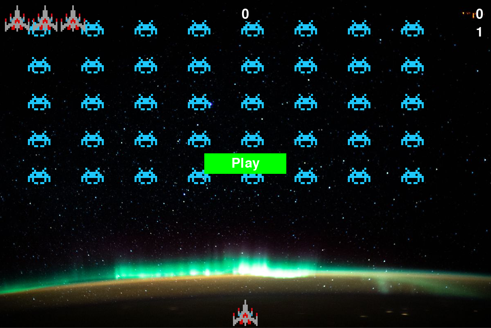
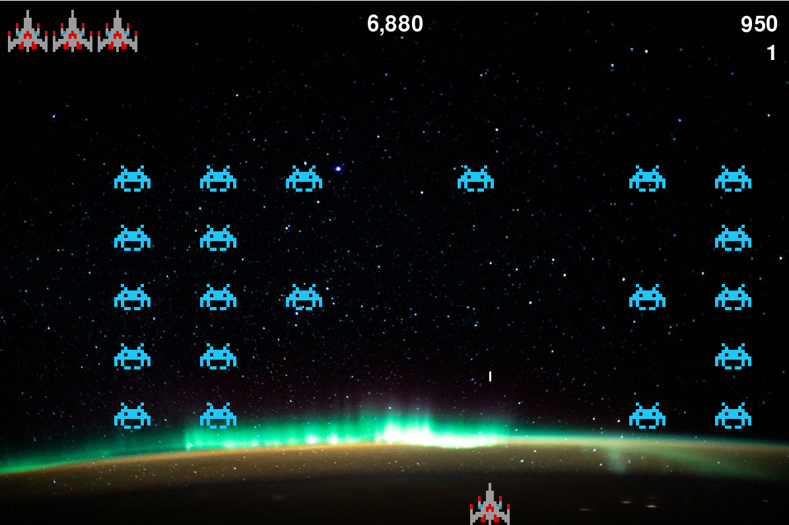

# AlienInvasion

 Alien Invasion is the spirit animal of Galaga. Players play as a space pilot tasked with destroying the evil aliens! As the game progresses the alien, ship, and bullet speeds will all continually increase. 

## Screenshots

  
  

## Dependencies
  * Python 
  * Pygame
 
## Usage
   
  python alien_invasion.py 

## Acknowledgements 
  
 Python Crash Course - Eric Matthes 

